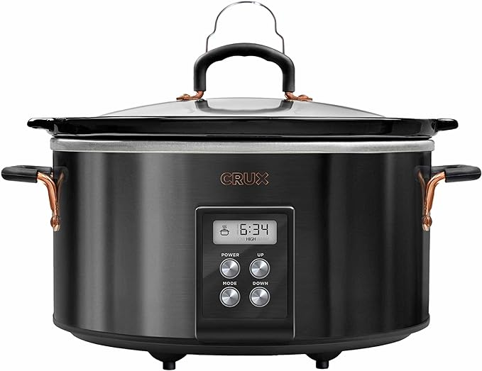

# Image Generation Using Stable Diffusion Inpainting

This repository contains the code for generating an image based on a given input image and text prompt using the **Stable Diffusion** inpainting model. The user can provide the path to the image and a text prompt via the command line, and the model will produce an enhanced version of the input image.

## Requirements

Ensure that the following Python libraries are installed:

- `torch`
- `diffusers`
- `rembg`
- `Pillow`
- `numpy`
- `argparse`

You can install the required libraries using the following commands:

```bash
pip install torch diffusers rembg pillow numpy argparse
```
Additionally, if you have GPU support, you can enable CUDA for faster performance:

```bash
pip install torch --upgrade --extra-index-url https://download.pytorch.org/whl/cu117
```

## Usage
You can run the script from the command line with the following parameters:

```bash
python run.py --image <image_path> --text-prompt "<your_text_prompt>" --output <output_path>
```

## Example Command:

```bash
python run.py --image ./example.jpg --text-prompt "A product in a kitchen used in meal preparation" --output ./generated.png
```
## Arguments

-`--image`: Path to the input image. (e.g., `./example.jpg`)

-`--text-prompt`: Text prompt that describes the scene to guide the inpainting model. (e.g., `"Product in a kitchen used in meal preparation"`)

-`--output`: Path to save the generated output image. (e.g., `./generated.png`)

## How it Works
1. Image Resizing and Background Creation: The input image is resized to fit a 512x768 resolution and placed in the center of a larger white background to create a 1024x1536 canvas.

2. Mask Creation: Using the rembg library, a mask is created to detect the object in the image, and the mask is then inverted for inpainting.

3. Inpainting with Stable Diffusion: The Stable Diffusion Inpainting model is applied to the image, using the provided text prompt to guide the generation process.

4. Result: The final image is saved at the specified location.

## Example Results

Input Image:



Generated Image:


## Known Issues

1. Slow Performance on CPU: If a GPU is not available, processing time might be slow, especially for large images.

2. Artistic Style: The output might vary depending on the complexity of the text prompt and the image. Experimenting with different prompts can improve results.

# Stable Diffusion Inpainting with Zoom-out Video Generation

This project generates a series of images using **Stable Diffusion inpainting**, which gradually zooms out from an initial image and then compiles the generated frames into a video.

The core process involves:
- Using the Stable Diffusion model to inpaint an image.
- Creating a sequence of frames that progressively zoom out.
- Combining these frames into a video.

## Requirements

Ensure you have the following dependencies installed before running the script:

### Installation

```bash
pip install torch diffusers rembg pillow numpy argparse imageio[ffmpeg]
```

- `torch`: For model inference with Stable Diffusion.
- `diffusers`: To handle the inpainting pipeline from the diffusers library.
- `rembg`: For removing the background and creating masks.
- `pillow`: For image processing.
- `numpy`: For image manipulation.
- `argparse`: For handling command-line arguments.
- `imageio`[ffmpeg]: To generate the video from frames.

## Usage

The script allows you to input an image, generate a series of zoom-out frames, and then compile them into a video. It uses command-line arguments to provide flexibility for input paths, output directories, and video options.

## Command Line Arguments

- `--image`: Path to the input image (required).
- `--output-dir`: Directory to save the generated frames (default: ./frames).
- `--output-video`: Path to save the final video (default: generated_zoom_out.mp4).
- `--num-frames`: Number of frames to generate (default: 30).
- `--zoom-out`: Enable the zoom-out effect during frame generation (optional flag).

## Example Usage

To run the script with an example image:

```bash
python run2.py --image ./example1.jpg --output-dir ./frames --output-video generated_zoom_out.mp4 --num-frames 30 --zoom-out

```

This will:

1. Take the input image (`example1.jpg`).
2. Generate 30 zoom-out frames.
3. Save the frames in the `./frames` directory.
4. Compile the frames into a video file (`generated_zoom_out.mp4`).

## Generated Video

Once the script runs, you will get a video that smoothly zooms out from the original image over a series of frames, creating a zooming-out effect.

## How It Works

1. Image Loading: The initial image is resized and processed.
2. Zoom-out Effect: Each frame slightly zooms out from the original image by resizing it.
3. Inpainting: Stable Diffusion inpainting is applied to ensure a smooth transition across frames.
4. Frame Generation: A series of images (frames) is generated and saved.
5. Video Compilation: These frames are compiled into a video using the imageio library.

## Notes

- Ensure you have a CUDA-compatible GPU to run the script faster, or it will fall back to CPU, which can be slower for large images.
- The --zoom-out flag enables the zoom-out effect. If not passed, the images will be generated without zooming.